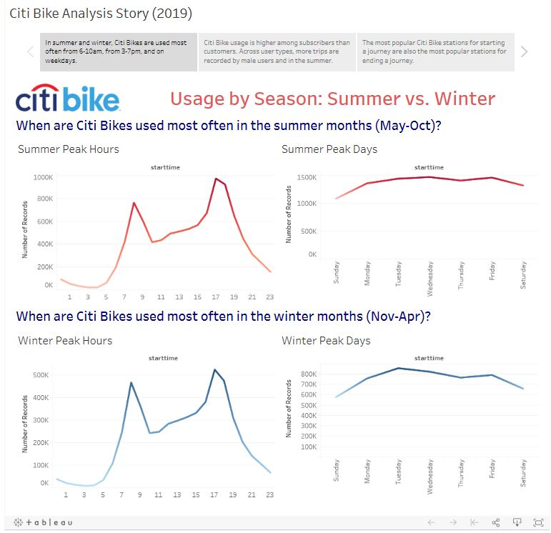
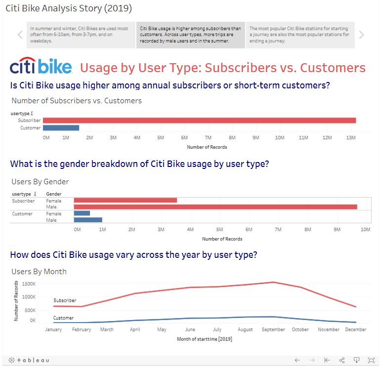
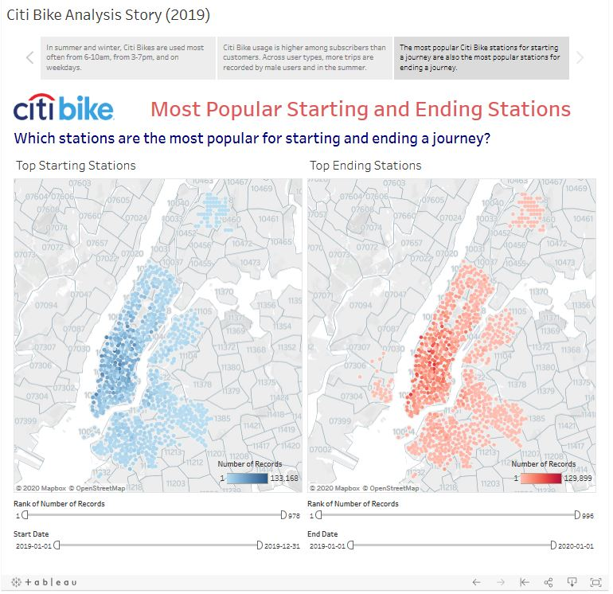

# Citi Bike Analysis

## **Objective:**
The objective of this project is to use Tableau to build interactive dashboards to present 2019 trip data from the New York Citi Bike Program. The datasets contain information on start and end time and date, start and end station name, station ID, station longitude and latitude, user type (subscriber vs. customer), user gender, and more.

The following interactive dashboards are presented as part of a Tableau story:
* Usage by Season: Summer vs. Winter.
* Usage by User Type: Subscribers vs. Customers.
* Most Popular Starting and Ending Stations.

## **Tools:**
1.	Tableau

## **Data Source:**
Citi Bike Trip Data: https://www.citibikenyc.com/system-data

## **Tableau Public Link:**
Citi Bike Analysis Story: https://public.tableau.com/profile/ivy4166#!/vizhome/CitiBikeAnalysis_15833838656860/CitiBikeAnalysisStory2019

## **Screenshots:**

